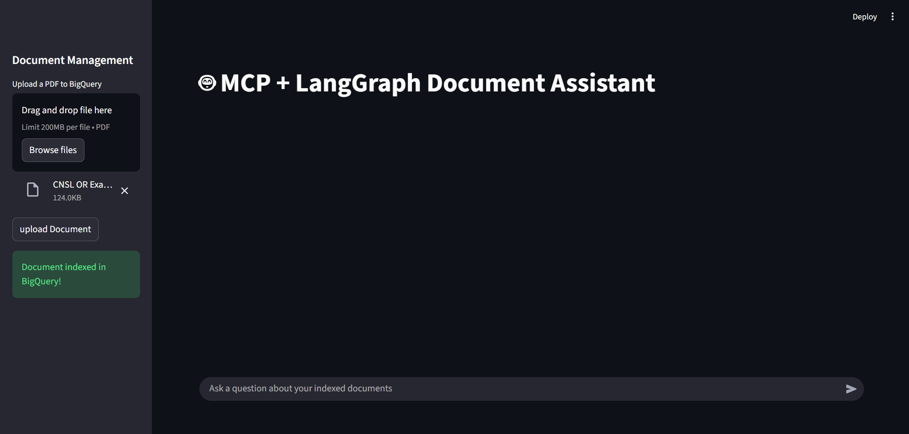
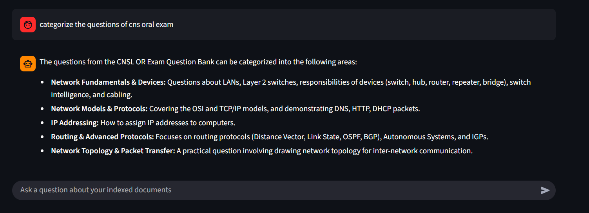

# 📄 BigQuery RAG Document Assistant  
**BigQuery · MCP · LangGraph · RAG  · Gemini  · Streamlit**

---

## 📌 Project Summary

This project is a **production-style Retrieval-Augmented Generation (RAG) system** that allows users to upload PDFs and ask questions over their content.

The system uses:
- **Google Gemini** for embeddings and answer generation  
- **BigQuery Vector Search - data warehouse** as the vector database  
- **LangGraph** for deterministic RAG orchestration
- **Top K** Relevance is ordered by cosine similarity ( cos (0) = 1 identical ) 
- **MCP (Model Context Protocol)** to expose RAG as a tool  
- **Streamlit** for an interactive chat UI  

It supports **multi-page PDFs**, semantic search, and structured agent execution.

---

## 🧠 High-Level Architecture

```
PDF Upload
↓
Text Extraction (PyMuPDF)
↓
Chunking (SentenceSplitter)
↓
Embedding (Gemini)
↓
BigQuery Vector Store
↓
User Question
↓
Query Embedding (Gemini)
↓
Vector Similarity Search (BigQuery) 
↓
Top K fetched
↓
Context Injection
↓
Answer Generation (Gemini)
```

---

## 🧱 Tech Stack

| Layer | Technology |
|------|-----------|
| LLM | Google Gemini 1.5 |
| Embeddings | Gemini text-embedding-004 |
| Vector Database | BigQuery Vector Search |
| Orchestration | LangGraph |
| Tool Protocol | MCP (FastMCP) |
| UI | Streamlit |
| PDF Parsing | PyMuPDF |
| Chunking | LlamaIndex SentenceSplitter |

---

## 📂 Project Structure

```
RAG/
│
├── app/
│ └── streamlit_app.py # Streamlit chat UI
│
├── docs_process/
│ └── parse_chunk_pdf.py # PDF parsing, chunking, embeddings
│
├── storage/
│ └── big_query.py # BigQuery batch insertion logic
│
├── rag/
│ └── nodes.py # LangGraph RAG nodes
│
├── llm/
│ └── llm.py # Gemini query & generation logic
│
├── mcp_protocol/
│ └── mcp_server.py # MCP tool server
│
├── .env # Environment variables
├── .gitignore 
├── requirements.txt
└── README.md
```

---

## 🔑 Environment Configuration

Create a `.env` file in the project root:

GEMINI_API_KEY=your_gemini_api_key
GOOGLE_APPLICATION_CREDENTIALS=path/to/service_account.json


> Application Default Credentials (ADC) are required for BigQuery access.

---

## 🛠️ BigQuery Setup

### 1️⃣ Create Dataset


### 2️⃣ Create Vector Table

```sql
CREATE TABLE rag_pdf.pdf_chunks (
  chunk_id STRING,
  document_id STRING,
  page_number INT64,
  section STRING,
  content STRING,
  embedding VECTOR<FLOAT64, 768>,
  created_at TIMESTAMP
);
```

```
python -m venv .venv
source .venv/bin/activate   # Windows: .venv\Scripts\activate
pip install -r requirements.txt

python mcp_protocol/mcp_server.py
```
```
streamlit run app/streamlit_app.py
```

# Output


